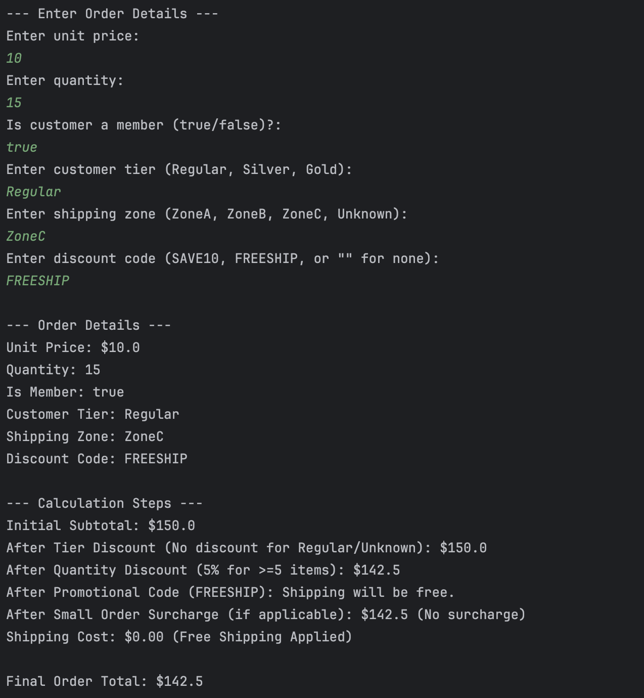
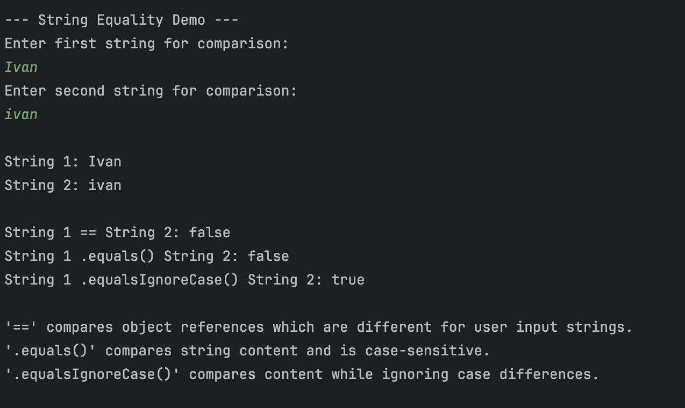

# Lab: Dynamic E-commerce Order Processor

## by: Ivan Patrick Frondozo

## Description:
This activity involves creating an interactive Java program that processes e-commerce orders with dynamic calculations for discounts, surcharges, and shipping.
It also demonstrates string comparison techniques using ==, .equals(), and .equalsIgnoreCase().

## Output:

